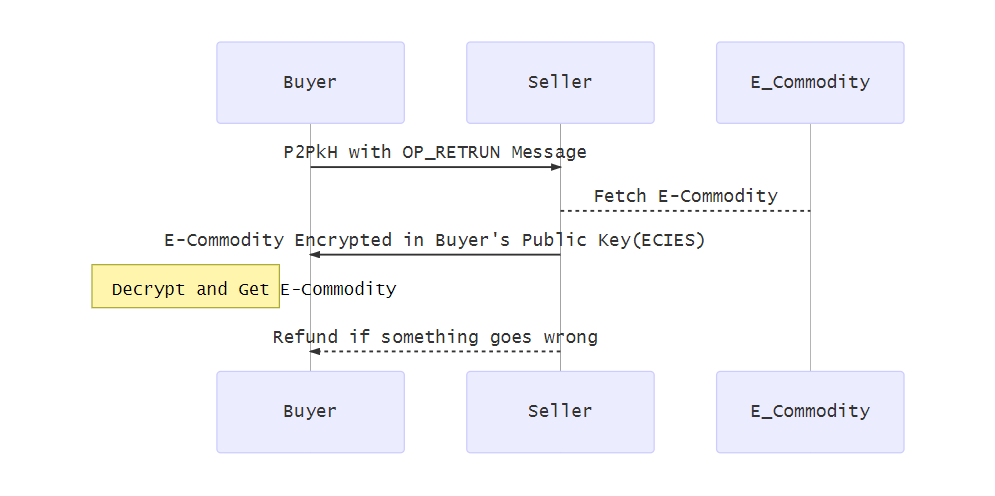
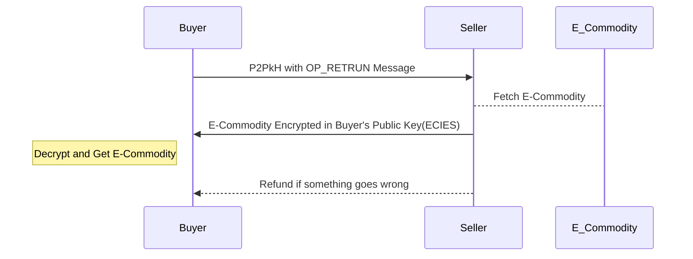

# Bishop
This project is to build shops on Bitcoin.

Bitcoin(SV) metanet transfers both data and money on TX, which can natively host shops.

### Featrues

Shop host on bitcoin will have

- Anoymous Buy/Sell
- Anoymous routing though nodes
- Native Payments
- No Server needed(you can handle TX in any device anywhere)
- Worldwide Aviliable
- Easily Deploy

### Applications

Can be used to sell any digital context.

- Software Activation Key Distribution.

  If you are a independent software developer, it saves you from maintaining payment channels in different countries.

- Encrypted File Selling.

  Films, documents, tools, etc. Upload encrypted files publicly and sell decrypt keys.

- Signatures.

- Or simple secret.

  Anything like thanks letter.

### Develop Plan
- [X] A Simple Shop Demo. [Nodejs Demo](https://github.com/monkeylord/Bishop/tree/master/Examples) , [HTML Demo](https://monkeylord.github.io/bitcoin/demo/SimpleShop.html)
- [ ] E-commercial protocol.
- [ ] A Full Shop implement.

## Simple Shop Logic

The Payment is no different from other TX.

The Encrypted E-Commodity can be decrypted with decent wallet.(Electrion Cash->Tools->Encrypt/Decrypt)

ECIES lib: [js](https://github.com/monkeylord/electrum-ecies)  [Go](https://github.com/gitzhou/bitcoin-ecies)

